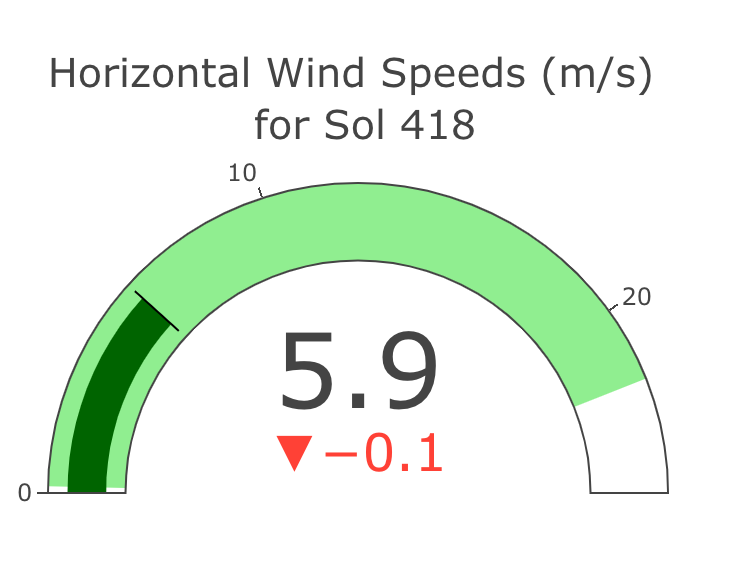
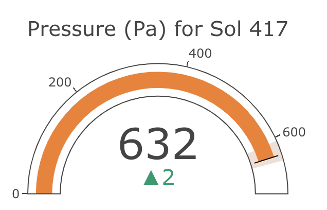
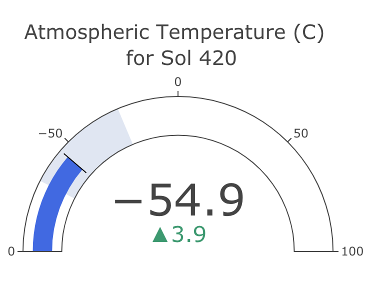

---

# What is maRs?

`maRs` is a R package with functions to retrieve and visualize weather data from the last 7 sols (martian days) which is daily updated by NASA's InSight Mars lander. InSight is located at Elysium Planitia, a flat surface near the equator of Mars.

---

# Software Requirements

`maRs` was built on R version 3.5.0; therefore, it is recommended to use a similar version or higher to avoid compatability issues.

# Installation

## clone repository

`git clone https://github.com/claudia-nikel/534_project/`

## in command line:

`R CMD build maRs`

`R CMD INSTALL maRs_0.1.tar.gz`

---

# Meet the data: 

**Windspeed**: retrieves the inputted sol's horizontal wind speed (m/s) from the summary table and visualizes it as a dial. The black bar is the average windspeed for the sol, which corresponds to the black text. The green background is the sol range (min and max), and the red or green text below is represents a decrease or increase, respectively, relative to the previous sol's average.

**Pressure**: retrieves the inputted sol's pressure (Pascal) from the summary table and visualizes it as a dial. The black bar is the average pressure for the sol, which corresponds to the black text. The orange background is the sol range (min and max), and the red or green text below is represents a decrease or increase, respectively, relative to the previous sol's average.

**Temperature**: retrieves the inputted sol's temperature (converted from Farhenheit to degrees Celsius) from the summary table and visualizes it as a dial. The black bar is the average pressure for the sol, which corresponds to the black text. The blue background is the sol range (min and max), and the red or green text below is represents a decrease or increase, respectively, relative to the previous sol's average.

**marsMM**: retrives the inputted sol's maximum and minimum value for temperature, windspeed and pressure and displays them in plot and histogram graphs for easier interpretation.

---

# Meet the functions

We start off by calling the library into the current session.

`library(maRs)`

### Below is the code for retrieving formatted data:

The formatting of data happens within the API, we can directly make use of the final output for our functions.

`marsInfo("yourAPI")` takes the API key you generated on [NASA Open APIs](https://api.nasa.gov/?search=mars) as a string.

`marsAverage(x, graph = NULL)` takes the saved output from the marsInfo() function and outputs a summary of the week's averages for temperature, horizontal windspeed, and pressure, which can be graphed with `graph = TRUE`. 

### Below is the code for windspeed():

`windspeed(sol, x)` where sol is sol number in the form of an integer and x is the saved output from the `marsInfo()` function.

### Below is the code for pressure():

`pressure(sol, x)` where sol is the sol number in the form of an integer and x is the saved output from the `marsInfo()` function.

### Below is the code for temperature():

`temperature(sol, x)` where sol is the sol number in the form of an integer and x is the saved output from the `marsInfo()` function.

For windspeed, pressure, and temperature visualizations, user must input a number from the previous 7 Sols. Since the function makes use of Plotly, you must save the function as a variable.

If the input is not within the last 7 Sols, an error message will return listing valid options.

### Below is the code for marsMM():

`marsMM(func='t',x)` where function represents which phenomenon you want data about and x is the saved output from the `marsInfo()` function.

use `func='t'` fot temperature.
use `func='w'` fot windspeed.
use `func='p'` fot pressure.

### Utilizing the plotting capabilities of maRs

The plot function of maRs is implicit, there is no need to call the plot function explicitly. Just make use of the variable that was assigned the function output and we should be able to plot a dial with our requested data.

# Examples

#### Saving the Mars data as a dataframe

`df <- marsInfo("yourAPI")`

#### Applying the windspeed visualization function

`w <- windspeed(415, df)`

`w`

#### Applying the pressure visualization function

`p <- pressure(415, df)`

`p`

#### Applying the temperature visualization function

`t <- temperature(415, df)`

`t`

#### Applying the temperature visualization function
`marsMM(func='t',x)`

`marsMM(func='w',x)`

`marsMM(func='p',x)`

*Authors:* Claudia Nikel, KT Hobbs, Shreeram Murali
